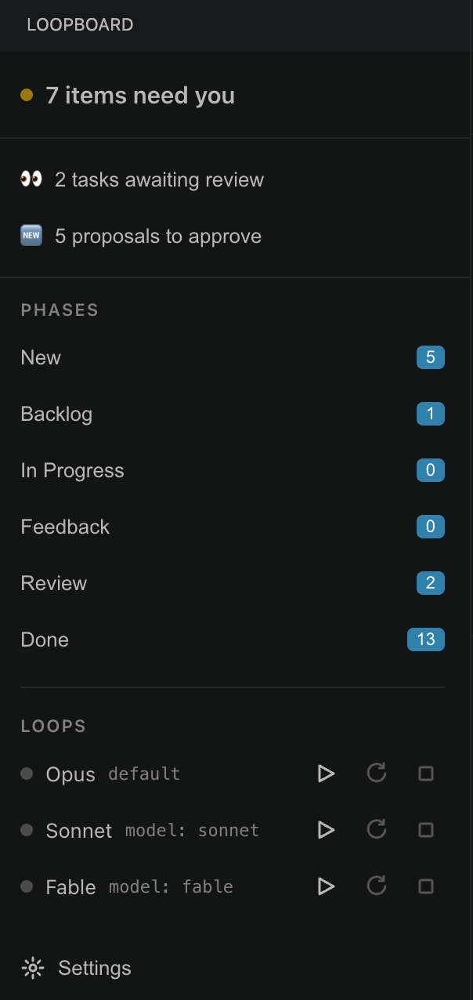

<div align="center">


# LoopBoard

**Your `TODO.md`, as a live board your AI agents work from.**

*Write stories in plain markdown — agent loops groom, build, and deliver them while you keep the only two keys that matter: what gets started, and what gets accepted.*

**⚠️ Beta:** still under active development — expect rough edges and breaking changes between
versions.

</div>

---

LoopBoard is a VSCode extension that renders the open workspace's `.loopboard/` tracker as an
interactive board: tick approval checkboxes, answer an AI worker's questions, review delivered
work, and spawn per-model Claude Code loop terminals — without editing markdown by hand.

> **⚠️ v2.0.0 is breaking — re-initialize your workspace.** v2 moved storage from a single root
> `TODO.md` into a `.loopboard/` directory (details below). There is **no migration**: the
> extension only recognizes the new layout and ignores a root `TODO.md`. Run
> **`LoopBoard: Initialize Workspace`** (or the board's empty-state button) to scaffold
> `.loopboard/`, then port any old tasks by hand.

Markdown stays the single source of truth. Every edit re-reads the disk, applies one field-level
patch, and writes the whole file back canonically (atomic temp-file + rename), so humans, the
board, and multiple agent loops can share it safely — now per file. Accepted work is archived to
`.loopboard/DONE.md`.

## Storage layout

```
.loopboard/
  TODO.md          slim task index — one entry per active task (id, phase, model, groomer, Q&A)
  DONE.md          accepted tasks, newest first (created lazily on the first acceptance)
  LOOP.md          workflow rules + the loop worker instructions the loops read every pass
  tasks/<id>.md    per-task detail: meta, description, notes, worklog, feedback, delivered
```

The board composes each card from the slim index entry plus its `tasks/<id>.md`. A task file is
created on the first detail edit (or the first loop write); on acceptance the index entry moves to
`DONE.md` while the task file stays in `tasks/` as browsable history.

## How it works

```
New → Backlog → In Progress → Review → Done (DONE.md)
                     ↕
                  Feedback
```

1. **You describe** a story in the "+ New story" composer (free text, no formatting needed) and
   pick which model **grooms** it and which model **executes** it.
2. **A loop grooms** the draft into a full story — title, description, scope — and surfaces any
   decisions it needs from you as inline questions on the card.
3. **You promote** it with a tick. A matching model loop claims it, works it, and parks it in
   **Feedback** whenever it would otherwise have to guess.
4. **You review** the DELIVERED summary — write change-request feedback to send it back, or tick
   to accept and archive it.

The board performs only the two human gates (promote and accept); everything else is a field
patch the loops react to on their next pass. No work starts and nothing ships without your tick.

## Sidebar

The activity-bar sidebar is the at-a-glance summary — everything in it is read-only and click-
through into the board:

| | |
|---|---|
|  | **Attention banner** ("7 items need you") rolls up everything currently waiting on you across the workspace, broken down into 👀 tasks sitting in **Review** and 🆕 groomed proposals sitting in **New** ready to promote.<br><br>**Phases** lists every column (New, Backlog, In Progress, Feedback, Review, Done) with a live task count, so you can see where work is piling up without opening the full board.<br><br>**Loops** shows one row per model (Opus, Sonnet, Fable) with its assigned role (`default` or a specific `model:`), a status dot for whether its terminal is running, and three controls: ▶ spawn/resume its loop terminal, ↻ recycle it (kill and restart), and ⏹ stop it.<br><br>**Settings** opens the extension's configuration (permission mode, default model, loop interval, auto-recycle). |

## Quick start

Open this folder in VSCode and press **F5** to start the Extension Development Host. The host
opens against this repo, whose `.loopboard/` tracker drives the board — if it has none yet, run
`LoopBoard: Initialize Workspace` (or click the board's empty-state button) to scaffold it. Click
the LoopBoard icon in the activity bar for the sidebar summary, then **Open Board** (or run
`LoopBoard: Open Board`).

## Build (Docker only)

Node and every other tool run **inside Docker** — nothing is installed on the host. The host
needs only Docker, `make`, git, and VSCode. All toolchain commands are wrapped in the `Makefile`:

```
make install    # npm install (typescript + @types/vscode only) in node:22
make build      # tsc -> out/
make test       # compile pure modules + run node --test round-trip / merge suites
make package    # build a .vsix via @vscode/vsce
```

Zero runtime dependencies; the webview is vanilla HTML/CSS/JS with a CSP nonce on every script.

## Using it

- **Left rail** — phases (New → Done) with counts and an amber attention dot when a phase needs
  you; per-model **Loops** with ▶ (start/focus) and ♻ (recycle) buttons; **＋ New story**.
- **New** — tick a task's checkbox to promote it to Backlog.
- **Feedback** — type an answer under each question; the loop resumes once all are answered.
- **Review** — read DELIVERED, optionally write review feedback (sends it back), or tick to accept
  (confirm) → archived to `DONE.md`.
- **New story** composer — write free text, choose the groom/worker models inline; it lands as a
  `DRAFT:` the loop grooms into a story.
- Edits save on blur/Enter as field patches. If the file changed on disk under your edit, the disk
  value wins and a toast tells you.

## Settings

| Setting | Default | Meaning |
|---|---|---|
| `loopBoard.permissionMode` | `auto` | `--permission-mode` passed to the claude CLI |
| `loopBoard.defaultModel` | `opus` | model that owns tasks with no `model:` field |
| `loopBoard.loopInterval` | `1m` | interval used in the injected `/loop` line |
| `loopBoard.autoRecycle` | `true` | recycle a model's terminal after it finishes a task |

> Migrating from "Claude TODO Board" (≤ 0.1.1): the extension, command, and settings ids were
> renamed from `claudeTodo.*` to `loopBoard.*` with no fallback — re-enter any custom
> settings.json values under the new keys.

## Loop terminals

The ▶ buttons open a plain VSCode terminal named `Claude <Model>` in the workspace root and run
`claude --model <m> --permission-mode <cfg>` with a tiny bootstrap prompt that points the loop at
`.loopboard/LOOP.md`'s Automation section — the standing instructions each loop re-reads every
pass. ♻ disposes and respawns for a fresh context. Loops die with the VSCode window (restart is one
click — all state lives in `.loopboard/`).

## Security model

**Treat `.loopboard/` and workspace settings as trusted input.** LoopBoard's core loop points an
autonomous `claude` session at `.loopboard/LOOP.md`'s Automation block, running with the configured
`loopBoard.permissionMode` — which may be `bypassPermissions`. Anything written into `LOOP.md` (or
the task files it tells the loop to open), or into `.vscode/settings.json`, therefore steers an
agent that can run commands on your machine. This is inherent to what LoopBoard does, not a bug.

Consequences:

- A `.loopboard/` from a source you don't control (a cloned repo, a shared workspace) is a
  prompt-injection vector with arbitrary-command-execution reach.
- **Review `.loopboard/LOOP.md` before starting a loop in a repo you didn't author**, and set
  `loopBoard.permissionMode` no higher than you're comfortable running unattended.

VSCode Workspace Trust gates activation, but trusting a repo to open it is not the same as vetting
what its `.loopboard/` will tell an agent to do.

## License

MIT
