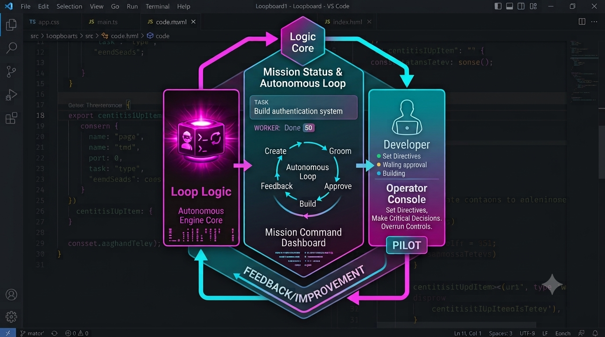
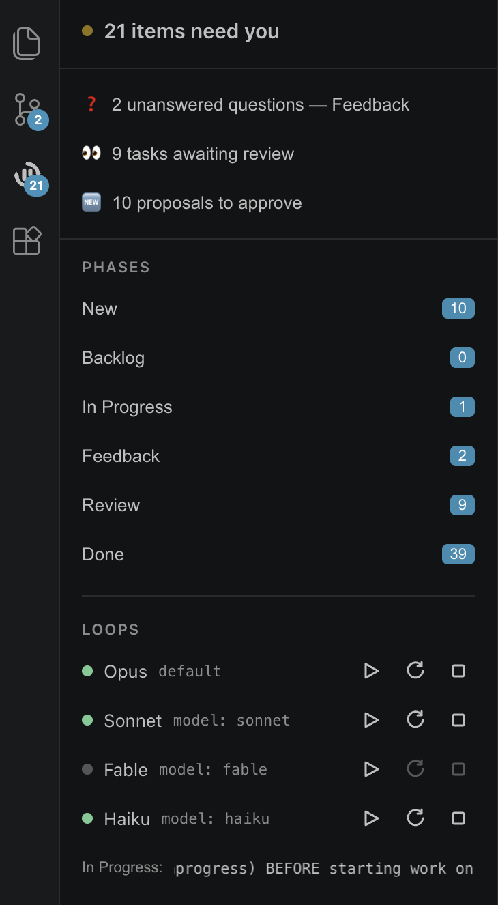

<div align="center">


# LoopBoard

[](https://github.com/SinnConsulting/LoopBoard/actions/workflows/publish.yml)
[](https://github.com/SinnConsulting/LoopBoard/actions/workflows/release.yml)
[](https://marketplace.visualstudio.com/items?itemName=SinnConsulting.loopboard-todo)

**The missing UI for Claude Code loops.**<br>
**Claude Code is the engine.**<br>
**LoopBoard is the cockpit.**<br>
**You're still the pilot.**

**Less prompting. No babysitting. More building.**

</div>

> Anthropic's developer loop—popularized by Head of Claude Code Boris Cherny—is a harness engineering approach where developers stop writing single, isolated prompts and instead build iterative, automated loops where Claude observes, plans, acts, and reflects over hours or days.



LoopBoard is a VSCode extension that turns your workspace `.loopboard/` tracker into an interactive
board your Claude Code agent loops groom, build, and deliver from — while you keep the only two keys
that matter: **what gets started, and what gets accepted.** Markdown stays the source of truth.

## Why LoopBoard?

| Without LoopBoard | With LoopBoard |
|-------------------|----------------|
| Start a new chat for every task | Create a task once |
| Write prompts | Press **Start** |
| Manage long-running sessions | LoopBoard manages the workflow |
| Coordinate planning and implementation yourself | Groomer and Worker collaborate |
| Constantly monitor the AI | Step in only when you're needed |
| Lose momentum during debugging | Chat with Claude and continue the loop |
| Juggle context across conversations | Everything stays attached to the task |
| Orchestrate autonomous workflows | Focus on building software |

## How LoopBoard works

1. Create a task.
2. Start the Groomer and Worker loops.
3. Review the Groomed story.
4. Approve it.
5. Let the Worker build.
6. Answer questions—or chat with Claude when deeper discussion is needed.

> **That's it.**


## Get started

Run **`LoopBoard: Initialize Workspace`** from the Command Palette (or the board's empty-state
button) to scaffold `.loopboard/` in your workspace. Click the LoopBoard icon in the activity bar
for the sidebar summary, then **Open Board** (or run `LoopBoard: Open Board`). Accepted work is
archived to `.loopboard/DONE.md`.

## Storage layout

```
.loopboard/
  TODO.md          slim task index — one entry per active task (id, phase, model, groomer, Q&A)
  DONE.md          accepted tasks, newest first (created lazily on the first acceptance)
  LOOP.md          workflow rules + the loop worker instructions the loops read every pass
  tasks/<id>.md    per-task detail: meta, description, notes, worklog, feedback, delivered
```

The board composes each card from the slim index entry plus its `tasks/<id>.md`. Every edit
re-reads the disk, applies one field-level patch, and writes the whole file back canonically
(atomic temp-file + rename) — so humans, the board, and multiple agent loops share it safely. On
acceptance the index entry moves to `DONE.md` while the task file stays in `tasks/` as history.

## Using the board

The activity-bar **sidebar** (left) is a read-only, at-a-glance summary — click any row to jump into the board. From top to bottom, it shows:

| | |
|---|---|
|  | <ul><li><b>Attention banner</b> — everything currently waiting on you: tasks in <b>Review</b> plus groomed proposals in <b>New</b> that are ready to promote.</li><li><b>Phases</b> — every column (New, Backlog, In Progress, Feedback, Review, Done) with a live task count.</li><li><b>Loops</b> — one row per model (Opus, Sonnet, Fable), each with its assigned role, a running-status dot, and ▶ spawn / ↻ recycle / ⏹ stop controls.</li><li><b>Settings</b> — opens the extension's configuration.</li></ul> |

On the board itself:

- **New** — tick a task's checkbox to promote it to Backlog.
- **Feedback** — type an answer under each question; the loop resumes once all are answered.
- **Review** — read DELIVERED, optionally write review feedback (sends it back), or tick to accept → archived to `DONE.md`.
- **New story** composer — write free text and choose the groom/worker models inline; it lands as a `DRAFT:` the loop grooms into a story.

Edits save on blur/Enter as field patches; if the file changed on disk under your edit, the disk
value wins and a toast tells you. The board performs only the two human gates — promote and accept —
everything else is a field patch the loops react to on their next pass.

## Loop terminals

The ▶ buttons open a plain VSCode terminal named `Claude <Model>` in the workspace root and run
`claude --model <m> --permission-mode <cfg>` with a tiny bootstrap prompt that points the loop at
`.loopboard/LOOP.md`'s Automation section — the standing instructions each loop re-reads every pass.
↻ disposes and respawns for a fresh context. Loops die with the VSCode window; restart is one click,
since all state lives in `.loopboard/`.

## Settings

| Setting | Default | Meaning |
|---|---|---|
| `loopBoard.defaultWorkerModel` | `sonnet` | model that works tasks with no `model:` field |
| `loopBoard.defaultGroomerModel` | `opus` | model that grooms tasks/drafts with no `groomer:` field |
| `loopBoard.permissionMode` | `auto` | `--permission-mode` passed to the claude CLI |
| `loopBoard.loopInterval` | `1m` | interval passed to the injected `/loop` line |
| `loopBoard.autoRecycle` | `false` | restart a model's terminal after it finishes a task (fresh context) |
| `loopBoard.clearSessionAfterTask` | `false` | lighter alternative — send `/clear` after a task instead of restarting |
| `loopBoard.models.<slot>` | — | per-slot overrides: `.enabled`, `.model`, `.effort` (see below) |

See [FAQ.md](FAQ.md) for common questions (e.g. why there's no Haiku slot).

### Configuring models (`loopBoard.models.<slot>`)

The built-in model slots — `opus`, `sonnet`, `fable` — are what you assign to tasks
(`model:` / `groomer:`) and what the sidebar **Loops** rows spawn. Each slot is configured through
three keys:

- `loopBoard.models.<slot>.enabled` — show/hide the slot in the Loops overview and the board's model selects.
- `loopBoard.models.<slot>.model` — the actual string passed as `claude --model <string>` (e.g. `opus[1m]` or a dated snapshot). Empty falls back to the slot's built-in default; anything outside `[A-Za-z0-9._\[\]-]` is rejected before it reaches the terminal.
- `loopBoard.models.<slot>.effort` — grooming-subagent reasoning-effort ceiling (`low`…`max`) for that slot, per Rule 14 in `LOOP.md`.

```jsonc
// Pin Opus to a dated snapshot; run Sonnet with the 1M-context window; hide Fable.
"loopBoard.models.opus.model": "claude-opus-4-8",
"loopBoard.models.sonnet.model": "sonnet[1m]",
"loopBoard.models.fable.enabled": false
```

> Migrating from "Claude TODO Board" (≤ 0.1.1): the extension, command, and settings ids were
> renamed from `claudeTodo.*` to `loopBoard.*` with no fallback — re-enter any custom settings.json
> values under the new keys.

## Build & contribute (Docker only)

Node and every other tool run **inside Docker** — nothing is installed on the host, which needs
only Docker, `make`, git, and VSCode. Open the folder in VSCode and press **F5** to launch the
Extension Development Host against this repo's own `.loopboard/` tracker. All toolchain commands are
wrapped in the `Makefile`:

```
make install    # npm install (typescript + @types/vscode only) in node:22
make build      # tsc -> out/
make test       # compile pure modules + run node --test round-trip / merge suites
make package    # build a .vsix via @vscode/vsce
```

Zero runtime dependencies; the webview is vanilla HTML/CSS/JS with a CSP nonce on every script.

## Security model

**Treat `.loopboard/` and workspace settings as trusted input.** LoopBoard points an autonomous
`claude` session at `.loopboard/LOOP.md`'s Automation block, running with the configured
`loopBoard.permissionMode` — which may be `bypassPermissions`. Anything written into `LOOP.md` (or
the task files it opens), or into `.vscode/settings.json`, steers an agent that can run commands on
your machine. This is inherent to what LoopBoard does, not a bug.

- A `.loopboard/` from a source you don't control (a cloned repo, a shared workspace) is a
  prompt-injection vector with arbitrary-command-execution reach.
- **Review `.loopboard/LOOP.md` before starting a loop in a repo you didn't author**, and set
  `loopBoard.permissionMode` no higher than you're comfortable running unattended.

VSCode Workspace Trust gates activation, but trusting a repo to open it is not the same as vetting
what its `.loopboard/` will tell an agent to do.

## Usage volume

Advertised usage limits for Pro and Max plans assume *"ordinary, individual usage of Claude Code and
the Agent SDK."* A tight loop (the default is `1m`) spinning multiple model terminals unattended
around the clock can push past that, and Anthropic may rate-limit or enforce against the account.
LoopBoard drives your own locally-authenticated Claude Code CLI — nothing here is against the ToS,
but its design encourages high-frequency multi-model looping, so it's worth being aware of.

---

<div align="center">

**Less prompting. No babysitting. More building.**

MIT License

</div>
