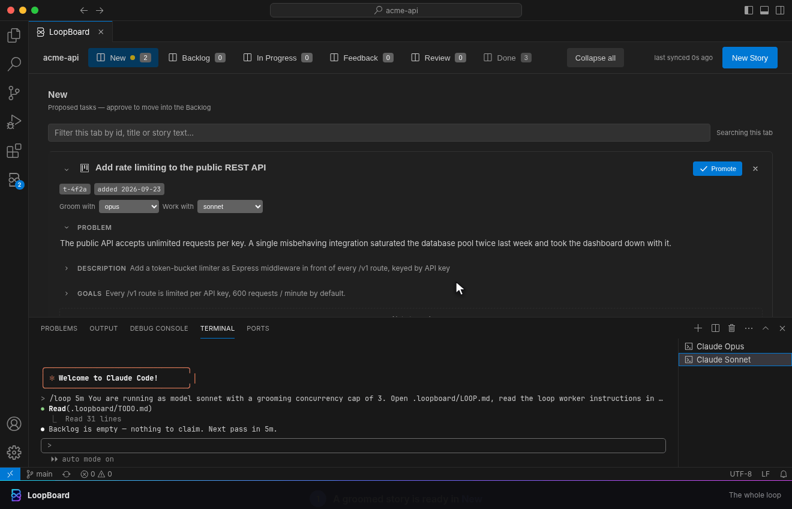
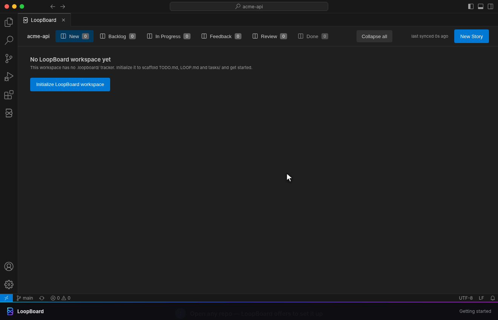
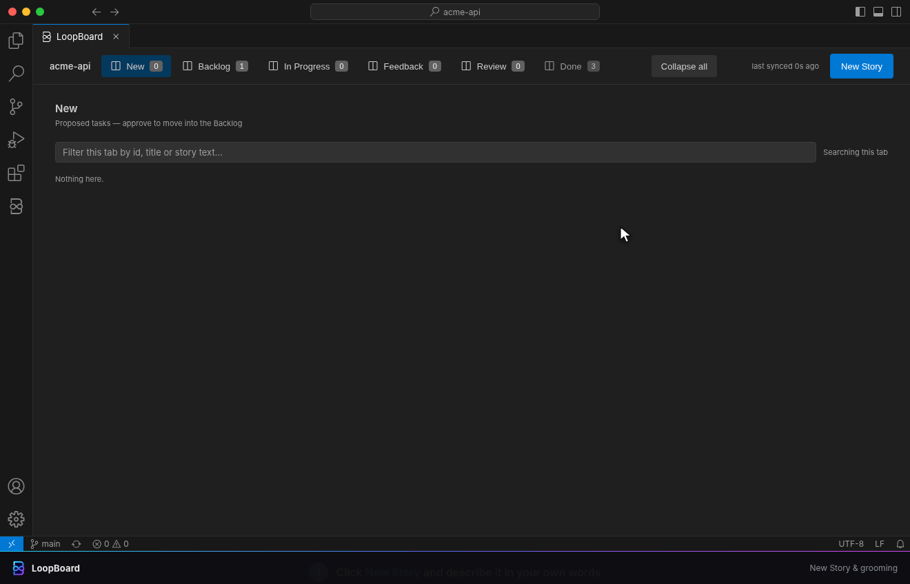
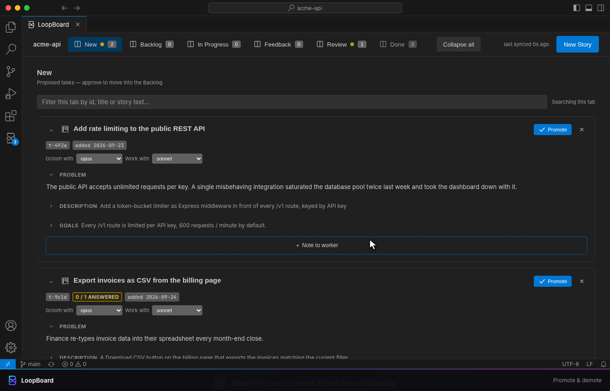
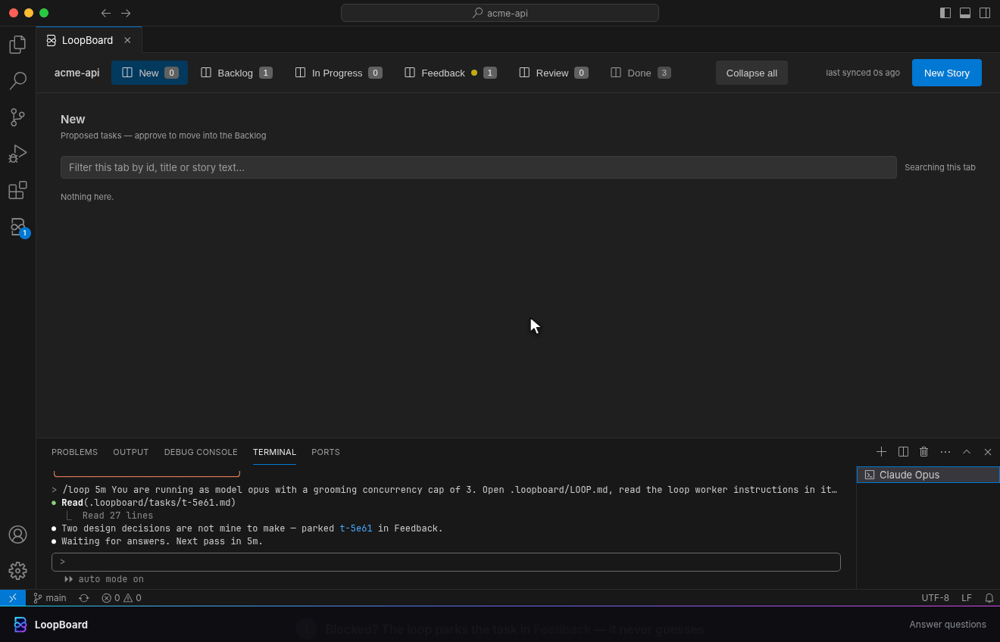
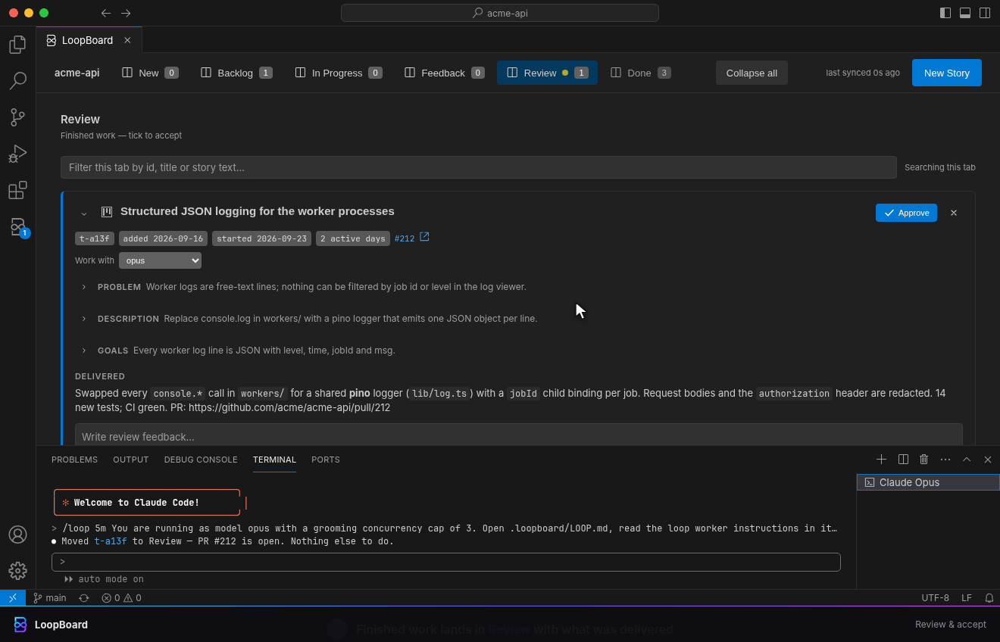
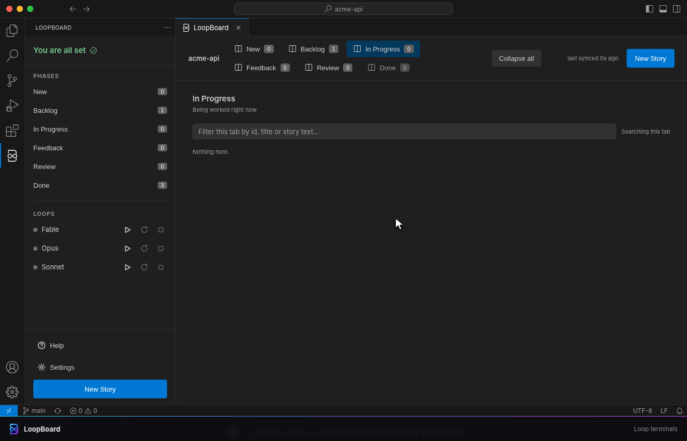
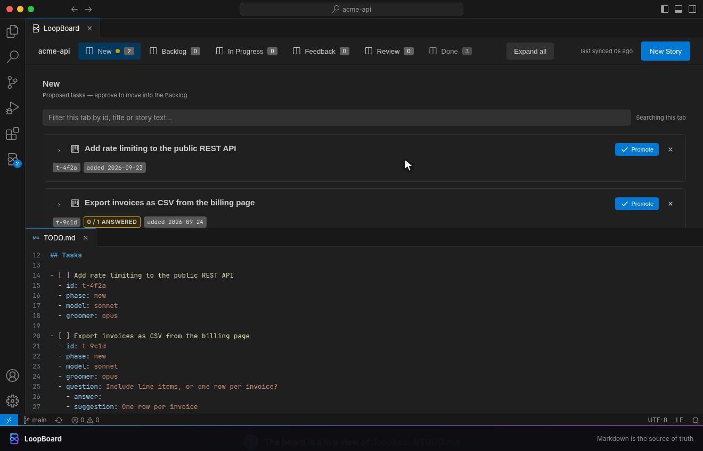
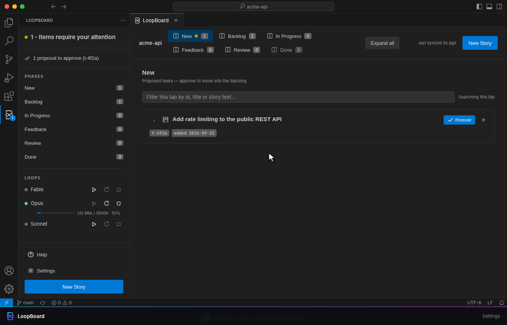

<div align="center">


# LoopBoard — Feature Showcase

**Claude Code is the engine. LoopBoard is the cockpit. You're still the pilot.**

One loop for the whole workflow, then one short loop per feature. Click any GIF to open it full
size.

</div>

---

<!-- Everything between the showcase sentinels is copied into the root README.md by `make readme`
     (relative links made absolute). Edit it HERE, never in README.md. -->
<!-- loopboard:showcase:begin -->

## The whole loop in 17 seconds

<p align="center">
  <a href="gifs/01-the-loop.gif"></a>
</p>

A groomed story waits in **New**. You **promote** it, and the Sonnet loop's next pass claims it,
builds it on a `task/**` branch, opens a PR and moves it to **Review**. You **approve** it, and
it's archived to `DONE.md`. You made two clicks. The loop did everything in between.

---

## Features at a glance

<table>
  <tr>
    <td width="50%" valign="top">
      <h3>1 · Getting started</h3>
      <p>One click scaffolds <code>.loopboard/</code> (<code>TODO.md</code>, <code>LOOP.md</code>, <code>tasks/</code>) and you write your first story.</p>
      <a href="gifs/09-getting-started.gif"></a>
    </td>
    <td width="50%" valign="top">
      <h3>2 · Write a story in plain words</h3>
      <p>It lands in New as a <code>DRAFT:</code>. The groomer loop turns it into a problem, a description, goals and questions for you.</p>
      <a href="gifs/02-new-story.gif"></a>
    </td>
  </tr>
  <tr>
    <td width="50%" valign="top">
      <h3>3 · Promote &amp; demote</h3>
      <p>Promote sends a story to the Backlog, the only place a loop claims work from. Demote undoes it, and nothing is lost.</p>
      <a href="gifs/03-gates.gif"></a>
    </td>
    <td width="50%" valign="top">
      <h3>4 · Answer questions</h3>
      <p>A blocked loop parks the task in Feedback instead of guessing. Answer it, or accept a suggestion, and the loop resumes.</p>
      <a href="gifs/04-feedback.gif"></a>
    </td>
  </tr>
  <tr>
    <td width="50%" valign="top">
      <h3>5 · Review, send back or accept</h3>
      <p>Read what was delivered. Review feedback sends the task back for rework, and Approve archives it to <code>DONE.md</code>.</p>
      <a href="gifs/05-review.gif"></a>
    </td>
    <td width="50%" valign="top">
      <h3>6 · Loop terminals</h3>
      <p>▶ starts one Claude Code terminal per model slot. Each row shows live context usage, and a right-click schedules a restart.</p>
      <a href="gifs/06-loops.gif"></a>
    </td>
  </tr>
  <tr>
    <td width="50%" valign="top">
      <h3>7 · Markdown is the source of truth</h3>
      <p>A click on the board rewrites <code>TODO.md</code>, and an edit to <code>TODO.md</code> repaints the board. There's no database.</p>
      <a href="gifs/07-markdown.gif"></a>
    </td>
    <td width="50%" valign="top">
      <h3>8 · Settings</h3>
      <p>All three model slots in one grid: <code>--model</code>, effort and groomers. They're plain VS Code user settings.</p>
      <a href="gifs/08-settings.gif"></a>
    </td>
  </tr>
</table>

---

## Details

<details>
<summary><b>1 · Getting started</b></summary>

Open any repository and click **Initialize LoopBoard workspace**, or run
**`LoopBoard: Initialize Workspace`** from the Command Palette. It refuses if `.loopboard/` already
exists.

| File | What it holds |
|---|---|
| `TODO.md` | The slim task index: one entry per active task (id, phase, model, groomer, Q&A) |
| `LOOP.md` | The workflow rules and the standing instructions every loop re-reads on each pass |
| `tasks/<id>.md` | Per-task detail: problem, description, goals, worklog, delivered |
| `DONE.md` | Accepted work, newest first. It's created on your first acceptance |

**Requires Claude Code 2.1.0 or newer.** Loops are spawned with `--name`, which older CLIs reject.

</details>

<details>
<summary><b>2 · Write a story in plain words</b></summary>

Click **New Story**, write the way you'd brief a colleague, and pick which model **grooms** the
story and which one **builds** it. On its next pass the groomer loop expands the draft through a
subagent (the sidebar's **Agents** section shows it while it runs):

- **Problem**: why the task exists, in a few factual sentences.
- **Description**: the groomed story itself.
- **Goals**: one verifiable outcome per bullet. Review later judges the delivery against these.
- **Questions**, if something is genuinely yours to decide, often with one-click suggested answers.

You can paste or drop screenshots into the composer. When you save, they're staged under
`.loopboard/cache/` and linked from the story.

</details>

<details>
<summary><b>3 · Promote &amp; demote</b></summary>

- **Promote** (on New) moves the story to **Backlog**, the only place a loop ever claims work from.
- **Demote** (on Backlog) sends it back to New with nothing lost. The store refuses the demote if
  a loop has already claimed the task.
- Loops never tick a box, and the board never moves a card optimistically: every move is a real
  write to `TODO.md` that the next refresh confirms.

At most one task is **In Progress** across the whole board. The sidebar shows which one, and which
Backlog work is queued behind it.

</details>

<details>
<summary><b>4 · Answer questions</b></summary>

When a loop hits a decision that's yours to make, it parks the task in **Feedback** with a question
and stops. When every question has an answer, the owning loop resumes the task on its own. By
default LoopBoard also **nudges** that loop: it pastes a one-line pointer into the loop's terminal,
so the loop acts now instead of waiting for its next scheduled pass. The nudge never interrupts
work that's already in flight.

</details>

<details>
<summary><b>5 · Review, send back or accept</b></summary>

Finished work lands in **Review** with its `## Delivered` summary and a link to the PR.

- **Not quite right?** Write review feedback. The loop picks the task back up, addresses the
  feedback, removes it and delivers again.
- **Happy with it?** Click **Approve**. The task is archived to `DONE.md` and its task file stays
  in `tasks/` as history.

Loops never merge a PR. Merging is always your call.

</details>

<details>
<summary><b>6 · Loop terminals</b></summary>

Each **▶** opens a plain VS Code terminal named `Claude <Model>` and starts one command:

```sh
claude --permission-mode auto --model 'opus' --effort medium --name loopboard-opus-<id> \
  '/loop 5m You are running as model opus with a grooming concurrency cap of 3. Open .loopboard/LOOP.md, …'
```

The prompt only points the loop at the **Automation** section of `.loopboard/LOOP.md`, which the
loop re-reads on every pass, so if you edit your rules there the running loops follow the edit.

- **Context bar.** Set `loopBoard.contextLimit.percent` and LoopBoard restarts (or `/clear`s) a
  session at that mark. A loop that owns the In Progress task is never interrupted: the restart
  waits until it's idle.
- **♻ / ■** restart a loop with a fresh context, or stop it. **Right-click** any of the three
  buttons to schedule that action.

The Claude sessions shown in these recordings are simulated, because VS Code gives extensions no
way to read a terminal. The spawn line is the one LoopBoard actually sends.

</details>

<details>
<summary><b>7 · Markdown is the source of truth</b></summary>

- **Click on the board → the markdown changes.** Every edit re-reads the file, applies exactly one
  field and writes it back canonically (atomic temp file + rename). That's how you, the board and
  several agent loops can share one file safely.
- **Edit the file → the board follows.** A hand edit, a `git pull` or a loop's write all repaint the
  board. If one of your saves collides with an on-disk change to the same field, the disk wins and
  a toast tells you.

`.loopboard/` is plain files that belong to you, and they survive uninstalling the extension.

</details>

<details>
<summary><b>8 · Settings</b></summary>

The sidebar's **Settings** row opens LoopBoard's own settings page. The model slots are one grid,
with a column each for **on**, **default worker**, **default groomer**, **`--model`**, **effort**
and **groomers**. Every other `loopBoard.*` setting is grouped into sections below it.

- These are ordinary **VS Code user settings**. Every key is application-scoped on purpose: a cloned
  repo can never decide how much authority your agent runs with.
- Spawn-time settings (`--model`, effort, the loop interval, the permission mode and so on) apply on
  the next ▶ start or ♻ restart.

</details>

---

## Cheat sheet

| You | The loops |
|---|---|
| Write a story in plain words | Groom it into problem, description, goals and questions |
| **Promote** New → Backlog | Claim the top Backlog task (one In Progress, board-wide) |
| Answer questions | Resume the parked task |
| Write review feedback | Rework the task and deliver again |
| **Approve** Review → `DONE.md` | Nothing more to do. The work is done |
| **Demote** Backlog → New | Leave it alone until you promote it again |

---

<details>
<summary><b>About these recordings</b></summary>

These GIFs aren't mock-ups. Each one renders the extension's **real webview code**
(`media/board.js`, `media/sidebar.js`, `media/settings.js`) in headless Chromium, inside a VS
Code–styled window. A small stand-in host answers the webviews' messages with the **same pure
modules the extension ships** (parser, writer, merge, gates, view, nudge, settings form), so every
click in a GIF rewrites the markdown exactly as the extension would. Time is fully scripted, so the
recordings are reproducible:

```sh
make showcase                 # every scene → docs/showcase/gifs/*.gif, then refresh README.md
make showcase SCENES="01 07"  # only the scenes named
make readme                   # README.md only: copy this page's showcase in, regenerate settings
```

Everything runs in Docker (`docs/showcase/studio/Dockerfile`: Playwright's Chromium, ffmpeg,
gifsicle), with no network access and the repository as the only mount. The scene scripts live in
`docs/showcase/studio/scenes/`.

</details>

<!-- loopboard:showcase:end -->

<div align="center">

**Less prompting. No babysitting. More building.**

</div>
